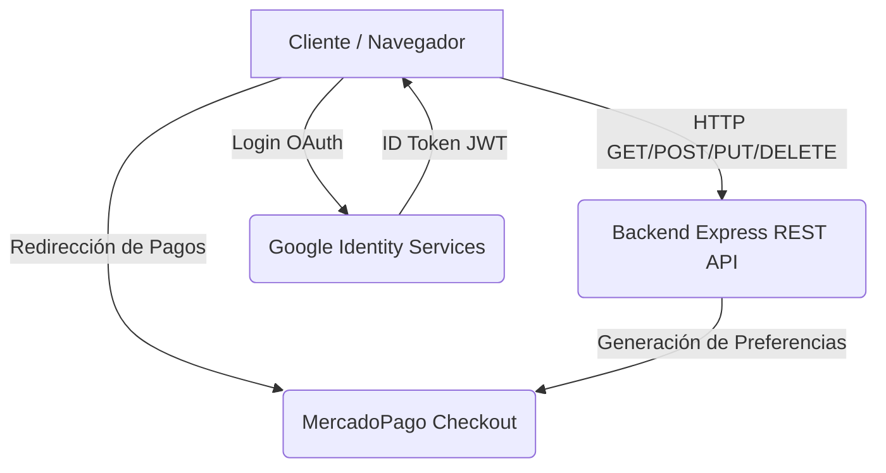

# 🍔 RestoYa - Frontend (Angular)

Este repositorio contiene el **Frontend** del sistema integral de gestión y delivery para restaurantes "RestoYa". Fue desarrollado utilizando **Angular 17+** y diseñado con enfoque Mobile-First usando **Bootstrap 5** y Vanilla CSS.

---

## 🎯 Objetivos del Proyecto
Diseñar e implementar un sistema web completo aplicando los conocimientos de **Programación y Servicios Web (UNJu)**. Este frontend se encarga de brindar una experiencia de usuario fluida, adaptativa y segura, consumiendo una API RESTful desarrollada en Node.js.

## 🛠️ Tecnología Aplicada
- **Framework Core:** Angular (Componentes, Routing, Reactive Forms).
- **Estilos y Maquetación:** Bootstrap 5, Vanilla CSS, Inter Font.
- **Iconografía:** FontAwesome 6, Google Material Symbols.
- **Autenticación Social:** Google Identity Services (`@abacritt/angularx-social-login`).
- **Alertas:** SweetAlert2.

---

## 🏗️ Arquitectura y Comunicación (Frontend <-> Backend)



---

## 📂 Estructura de Carpetas

```text
src/
 ├── app/
 │   ├── components/         # Componentes visuales modulares
 │   │   ├── admin-productos/  # CRUD del Menú
 │   │   ├── layout-pedido/    # Sistema de Carrito y Checkout
 │   │   ├── login/            # Autenticación de Empleados
 │   │   ├── mesa/             # Gestión de Mesas del local
 │   │   ├── sidebar/          # Navegación del sistema
 │   │   └── usuario-form/     # Gestión de Empleados
 │   ├── models/             # Interfaces de TypeScript
 │   ├── pipes/              # Pipes personalizados (e.g. estado-pedido)
 │   └── services/           # Comunicación HTTP con el Backend
 │       ├── auth.service.ts
 │       ├── carrito.service.ts
 │       ├── pago.service.ts
 │       └── producto.service.ts
 ├── assets/                 # Imágenes estáticas y recursos
 ├── index.html              # Punto de entrada y CDNs
 └── styles.css              # Estilos globales y tokens de diseño
```

---

## 👥 Funcionalidades por Rol

El sistema adapta su interfaz dependiendo del rol del usuario autenticado:

- **Cliente (Público):** Puede ver el menú digital interactivo, agregar productos al carrito, e iniciar sesión con Google para proceder al pago online (Delivery) mediante MercadoPago.
- **Mozo:** Puede ver el mapa de mesas, cambiar su estado (Libre/Ocupada), enviar comandas a la cocina, y **visualizar el detalle del pedido activo (ticket completo con bebidas)** directamente desde la tarjeta de la mesa.
- **Cocina:** Visualiza en tiempo real los ítems pendientes por preparar y los marca como "Listos" para despachar. (No visualizan bebidas).
- **Cajero:** Visualiza los pedidos listos y gestiona el cobro presencial (Efectivo/Transferencia).
- **Gerente:** Tiene acceso total. Gestiona Usuarios (ABM de empleados), Productos (ABM del menú) y la **Auditoría (Historial de Accesos)**. Las tablas de gestión cuentan con **Paginación inteligente** para manejar grandes volúmenes de datos. Además visualiza el Dashboard de estadísticas.

---

## 🔌 APIs Externas Utilizadas (Consumo Frontend)

1. **Google Identity Services:** Implementado en el flujo de pagos. El cliente hace clic en "Pagar", se abre el pop-up de Google, y el frontend captura el ID Token para enviarlo a nuestro backend.
2. **MercadoPago Checkout Pro:** Al confirmar el carrito, el frontend recibe un `init_point` del backend y redirige al usuario a la pasarela de pagos segura de MercadoPago.

---

## 🛡️ Mecanismos de Seguridad Implementados (Frontend)

- **Guards de Angular:** Protegen las rutas privadas (`/admin`, `/cocina`, etc.) para que no se pueda acceder ingresando la URL manualmente si no se tiene el Rol correspondiente.
- **Almacenamiento Seguro:** Manejo de JWT en `localStorage`.
- **Formularios Reactivos (Reactive Forms):** Validaciones estrictas del lado del cliente (ej. requerimiento de Apellido, validación de formato de Email, contraseñas de más de 6 caracteres, DNI numérico).
- **Control de Estado Visual:** Los botones de "Guardar" se deshabilitan si el formulario es inválido o si ya hay una petición HTTP en curso, previniendo el Doble-Submit.

---

## 📸 Capturas de Pantalla

> *(Colocar aquí las capturas de pantalla requeridas para el informe final)*
> 
> ``
> ``
> ``
