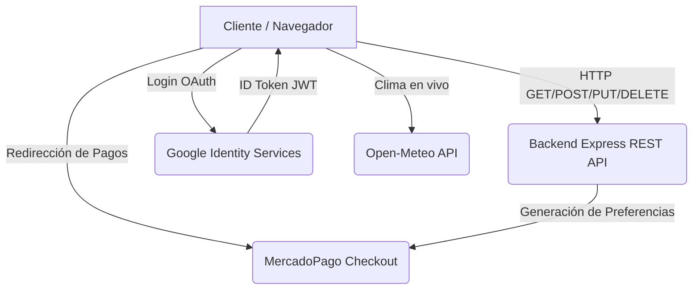

# 🍔 RestoYa - Frontend (Angular)

Este repositorio contiene el **Frontend** del sistema integral de gestión y delivery para restaurantes "RestoYa". Fue desarrollado utilizando **Angular 17+** y diseñado con enfoque Mobile-First usando **Bootstrap 5** y Vanilla CSS.

---

## 🎯 Objetivos del Proyecto
Diseñar e implementar un sistema web completo aplicando los conocimientos de **Programación y Servicios Web (UNJu)**. Este frontend se encarga de brindar una experiencia de usuario fluida, adaptativa y segura, consumiendo una API RESTful desarrollada en Node.js, e integrando múltiples APIs de terceros de manera nativa.

## 🛠️ Tecnología Aplicada
- **Framework Core:** Angular (Componentes, Routing, Reactive Forms).
- **Estilos y Maquetación:** Bootstrap 5, Vanilla CSS, animaciones personalizadas (Glassmorphism, micro-interacciones).
- **Iconografía:** FontAwesome 6.
- **Alertas y UI:** SweetAlert2 y Angular CDK (Drag & Drop para Chatbot).

---

## 🏗️ Arquitectura y Comunicación (Frontend <-> Backend)



---

## 📂 Estructura de Carpetas

```text
src/
 ├── app/
 │   ├── components/         # Componentes visuales modulares
 │   │   ├── admin-productos/  # CRUD del Menú (Platos, Postres, Bebidas)
 │   │   ├── caja/             # POS, Cobros en efectivo, Ticket de Venta y Reportes
 │   │   ├── chatbot/          # Asistente IA Integrado (Draggable)
 │   │   ├── home/             # Landing Page con Widget del Clima
 │   │   ├── layout-pedido/    # Sistema de Carrito y Checkout
 │   │   ├── login/            # Autenticación de Empleados
 │   │   ├── mesa/             # Gestión de Mesas del local
 │   │   ├── sidebar/          # Navegación del sistema
 │   │   └── usuario-form/     # Gestión de Empleados
 │   ├── models/             # Interfaces de TypeScript
 │   ├── pipes/              # Pipes personalizados (e.g. estado-pedido)
 │   └── services/           # Comunicación HTTP con el Backend
 ├── assets/                 # Imágenes estáticas y recursos
 ├── index.html              # Punto de entrada y CDNs
 └── styles.css              # Estilos globales y tokens de diseño
```

---

## 👥 Funcionalidades por Rol

El sistema adapta su interfaz dependiendo del rol del usuario autenticado:

- **Cliente (Público):** Puede ver el menú digital interactivo, agregar productos al carrito (Platos, Bebidas, Postres), interactuar con el **Chatbot**, e iniciar sesión con Google para proceder al pago online (Delivery) mediante MercadoPago.
- **Mozo:** Puede ver el mapa de mesas, cambiar su estado (Libre/Ocupada), enviar comandas a la cocina, y **visualizar el detalle del pedido activo (ticket con bebidas incluidas)**.
- **Cocina:** Visualiza en tiempo real los **Platos y Postres** pendientes por preparar y los marca como "Listos" para despachar. (La interfaz de cocina filtra automáticamente las bebidas para no sobrecargar a los cocineros).
- **Cajero:** Su pantalla de `Caja` se transforma en un moderno Punto de Venta (POS). Puede abrir/cerrar turnos, ver la lista de mesas que terminaron de comer, y al hacer clic en "Cobrar", se genera un **Ticket de Venta visual** que, tras confirmar el pago en efectivo, suma la ganancia y libera la mesa automáticamente.
- **Gerente:** Tiene acceso total. Gestiona Usuarios (ABM con validaciones estrictas), Productos (ABM del menú) y la **Auditoría (Historial de Accesos)**. Visualiza el Dashboard de estadísticas y puede exportar la recaudación en formato PDF o Excel.

---

## 🔌 APIs Externas Utilizadas (Consumo Frontend)

1. **Google Identity Services:** Implementado en el flujo de pagos. El cliente hace clic en "Pagar", se abre el pop-up de Google, y el frontend captura el ID Token para enviarlo a nuestro backend.
2. **MercadoPago Checkout Pro:** Al confirmar el carrito, el frontend recibe un `init_point` del backend y redirige al usuario a la pasarela segura.
3. **Open-Meteo API (Clima):** La página principal (Home) consume esta API geolocalizada en San Salvador de Jujuy. Si detecta lluvia, muestra una alerta dinámica informando posibles demoras en los envíos de Delivery.
4. **Chatbot API:** Módulo visual en el frontend que permite al cliente despejar dudas de manera autónoma, utilizando el `Angular CDK Drag` para posicionarlo libremente en pantalla.

---

## 🛡️ Mecanismos de Seguridad y UX Implementados

- **Validaciones Estrictas (Reactive Forms):** Control implacable de los datos de entrada (ej. Nombres solo permiten letras y mínimo 2 caracteres, DNI exacto de 8 números). Si hay error, el botón de guardado se bloquea y se muestra ayuda visual.
- **Guards de Angular:** Protegen las rutas privadas (`/admin`, `/cocina`, etc.) verificando los permisos y el Token del usuario.
- **Prevención de Errores Humanos:** Interfaz de Caja diseñada para evitar "mesas fantasma". Los Mozos ya no cierran transacciones monetarias; el Cajero centraliza los cobros.
- **Feedback UI:** Spinners de carga (SweetAlert2) durante los llamados a la API para prevenir que el usuario presione botones múltiples veces.

---
*Desarrollado para la cátedra Programación y Servicios Web - UNJu*
